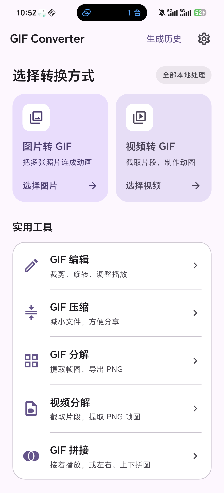
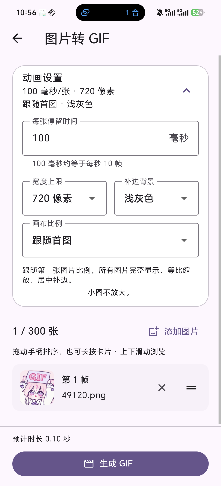
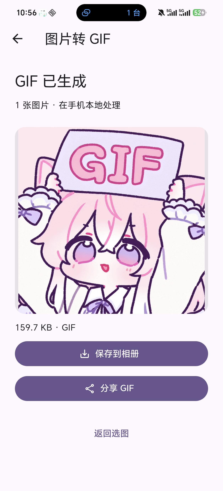
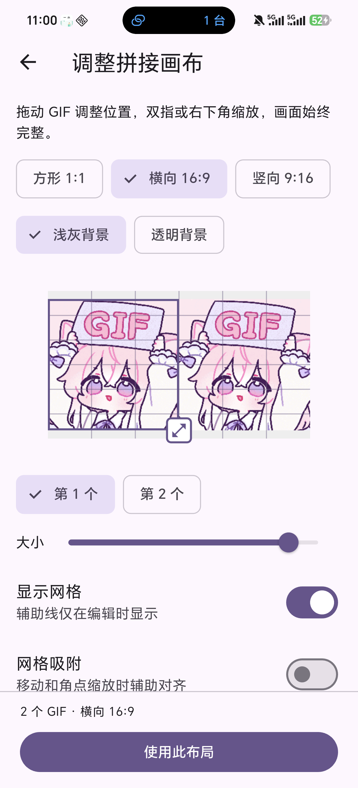
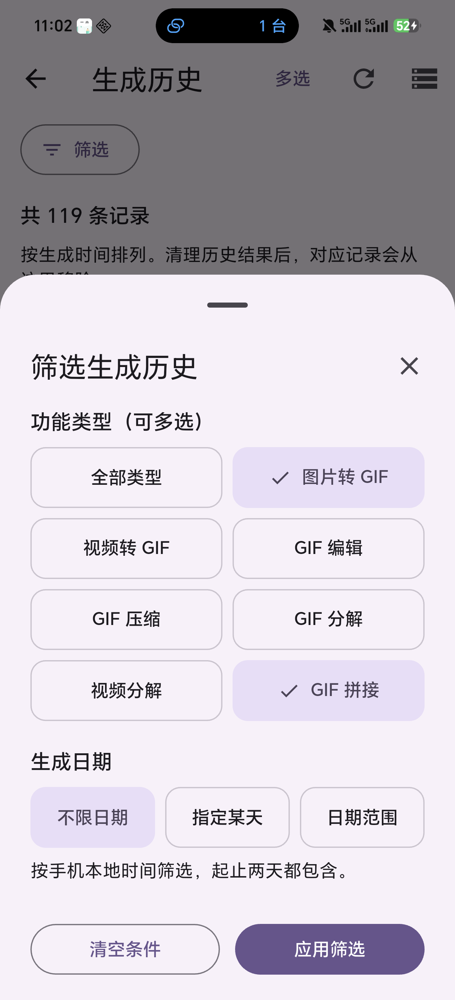
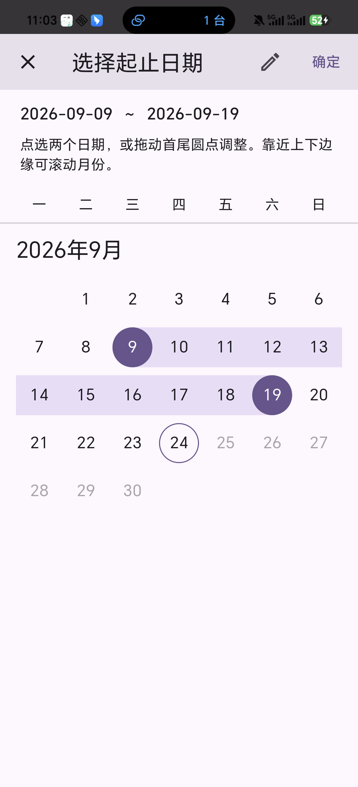

# GIF Converter


在 Android 手机上制作和处理 GIF 的本地工具。图片、视频和动图在手机上处理，无需上传到转换服务器；结果可以预览、保存到相册和分享。

**v0.1.0 公开测试版已发布。** 本仓库提供 Android 安装包、界面介绍、使用说明及第三方组件材料；应用源码仓库继续私有。

## 获取测试包

[下载 Android 安装包](https://github.com/LingXia979/GIF-Converter-Releases/releases/download/v0.1.0/GIF-Converter-v0.1.0-arm64.apk) · [v0.1.0 测试版发布页](https://github.com/LingXia979/GIF-Converter-Releases/releases/tag/v0.1.0)

文件名为 `GIF-Converter-v0.1.0-arm64.apk`。发布页同时提供 FFmpeg 对应源码包、第三方许可包、安装说明、免责声明、公开签名证书与 SHA-256 校验清单。

| 项目 | 当前测试包 |
| --- | --- |
| 安装版本 | 0.1.0，版本代码 6 |
| 设备条件 | Android 12+，arm64-v8a（64 位 ARM） |
| APK 大小 | 23,133,504 字节，约 23.13 MB |
| 验证状态 | 电脑与包体检查、同内容本地预览版的功能验收通过；正式签名包的真机安装验收待完成 |

APK SHA-256：

```text
4d5d76cdc533392c3ac3e5a59df538ab9465c8d09a5267b9b58a40fc3c8b88b1
```

**已装旧内部测试版时，请先阅读[安装说明](INSTALLATION.md)。** 新包使用正式签名，不能直接覆盖旧调试签名版；卸载会删除应用内历史及未另存文件。重要 GIF、PNG 和 ZIP 请先另存并检查副本。

## 应用界面

以下为 v0.1.0 build 6 的手机实机截图，示例素材使用本项目图标。点击图片可查看大图。

| 首页 | 图片转 GIF | 结果预览 |
| --- | --- | --- |
| <a href="screenshots/v0.1.0/01-home.png"></a> | <a href="screenshots/v0.1.0/02-image-to-gif.png"></a> | <a href="screenshots/v0.1.0/03-result-preview.png"></a> |
| 选择制作或处理功能 | 调整动画参数与图片顺序 | 预览、保存与分享 |

| 自定义画布拼接 | 历史功能筛选 | 日期范围 |
| --- | --- | --- |
| <a href="screenshots/v0.1.0/04-canvas-joining.png"></a> | <a href="screenshots/v0.1.0/05-history-filter.png"></a> | <a href="screenshots/v0.1.0/06-date-range.png"></a> |
| 自由拖动、缩放与网格对齐 | 按功能与日期找回结果 | 拖动首尾，包含起止两天 |

## 支持的功能

本次 build 6 增加历史按功能/日期筛选、可拖动的日期范围，以及固定位置的居中选项按钮。沿用粉紫色举牌图标，适配 Android 圆形、圆角和系统主题图标。

- **图片转 GIF**：调整顺序、帧间隔、输出尺寸，以及横向、竖向或方形画布和补边。
- **视频转 GIF**：选择片段和画面区域，调整输出尺寸、帧率与播放速度。
- **GIF 编辑**：裁切片段、删帧、裁剪、旋转、缩放、变速、倒放、播放次数与撤销/恢复。
- **GIF 压缩**：三档预设；没有进一步缩小时保留原 GIF。
- **GIF / 视频分解**：预览和选帧，直接保存 PNG 到相册，或导出 ZIP。
- **GIF 拼接**：顺序、左右、上下和自定义画布；支持自由拖动、等比缩放、透明/浅灰背景及可选网格吸附。
- **生成历史**：查看 App 内的 GIF 和分解结果，再次预览或保存，GIF 还可分享；支持单条或批量删除。
- **历史筛选**：七种功能可多选，可指定某天或包含首尾的日期范围；预览返回和刷新保留条件。日期范围首尾可拖动，靠近上下边缘可跨月滚动，也能点选或输入日期。全选只作用于当前筛选结果，换条件会清除旧勾选。

## 手机性能与兼容性

本地转换会占用处理器、内存和存储，可能增加耗电、使手机发热。建议先用少量图片、短片段和较低尺寸或帧率尝试；尽量避免边充电边连续处理大任务。明显发烫或系统提示温度过高时，请取消任务，等待降温。当前版本没有自动温度监测或过热暂停功能。

既有功能主要在 BKQ AN80 / Android 16 / 4 KB 页面设备上验证；最终签名 APK 的安装与运行仍待确认。其他机型、Android 12–15 完整运行矩阵及真正的 16 KB 页面环境尚未完成验证。相册可能忽略 GIF 循环次数，对透明背景或缩放的显示也可能不同。

视频源片段目前支持 0.1～10 秒；拼接支持 2～6 个 GIF、输入合计最多 600 帧、输出最长 120 秒。请保留原素材并检查生成结果。

## 使用须知与反馈

[安装与数据保留](INSTALLATION.md) · [使用须知与免责声明](DISCLAIMER.md) · [本版介绍](RELEASE_NOTES.md) · [测试清单](TESTING.md)

仅处理自己拥有权利或已获得授权的素材。软件按当前状态提供，不减损适用法律规定的用户权利；完整数据说明及责任范围见免责声明。

遇到问题可在本仓库 [Issues](https://github.com/LingXia979/GIF-Converter-Releases/issues) 反馈，请提供版本、手机型号、Android 版本、使用的功能和参数、复现步骤及实际结果。素材请先确认有权分享，并移除个人信息；不需要提供完整私人相册。

## 第三方组件

使用 [FFmpeg](https://ffmpeg.org/) 8.1.2（LGPL-2.1-or-later）。每版下载材料同时提供完整对应源码、项目补丁与重建方法 `FFmpeg-8.1.2-source.zip`，以及第三方许可和通知 `THIRD-PARTY-NOTICES.zip`。App 设置中也可查看开源许可。第三方组件保留各自版权和许可；本仓库不包含应用私有源码。

## 共同作者

- [LingXia979](https://github.com/LingXia979)：项目维护、功能方向与真机体验验收。
- [Codex / ChatGPT](https://github.com/codex)：AI 开发协作，参与实现、修复、验证与材料整理。
