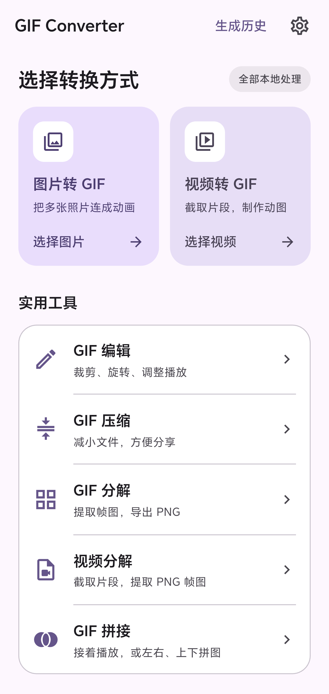
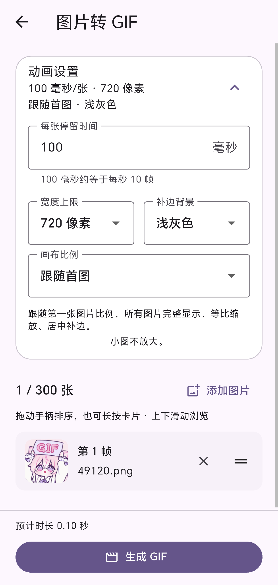
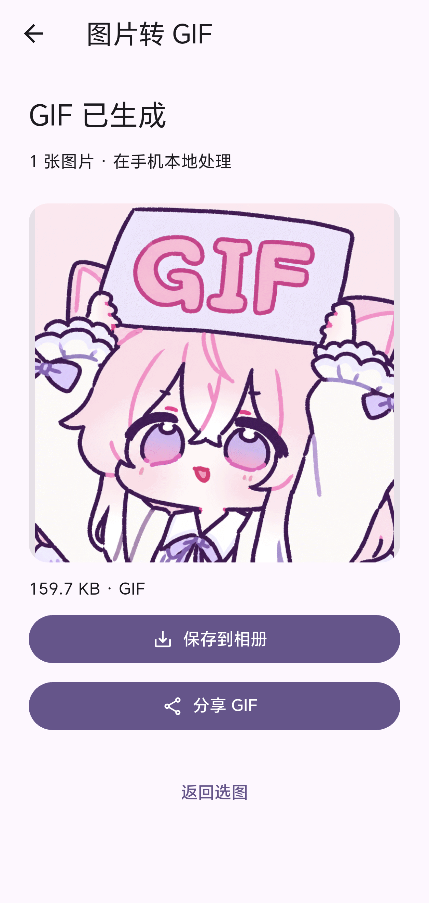
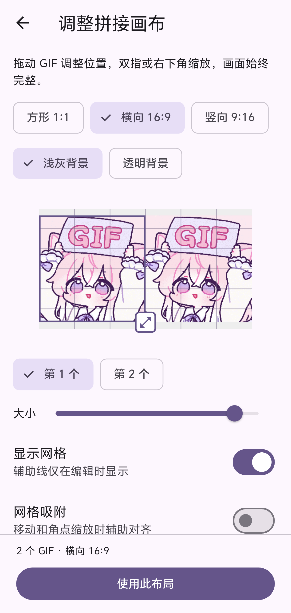
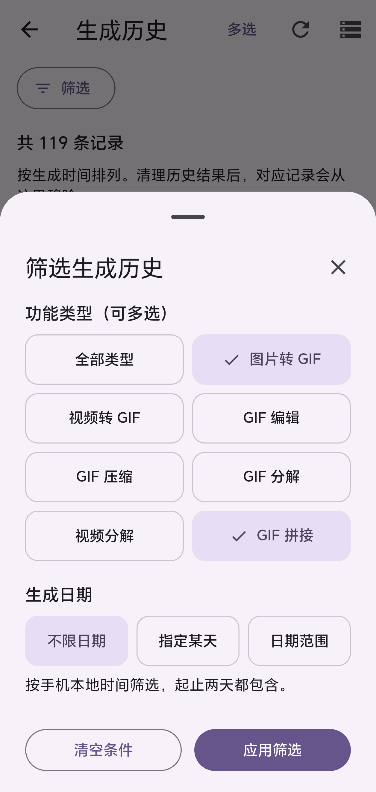
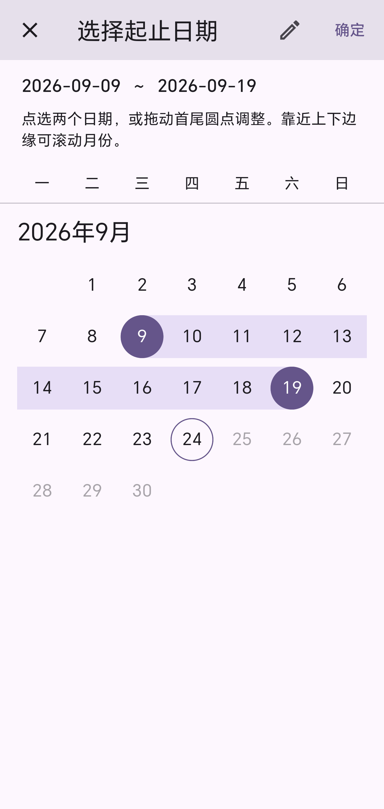

# GIF Converter


在 Android 手机上制作和处理 GIF 的本地工具。素材在手机上处理，无需上传到转换服务器；结果可以预览、保存到相册和分享。

**v0.1.8 正式版：自定义处理上限与视频修复。** 支持 Android 10+ 的 arm64 手机。本仓库提供安装包、使用说明及第三方组件材料，应用源码仓库继续私有。

## 下载安装

[下载 Android 安装包](https://github.com/LingXia979/GIF-Converter-Releases/releases/download/v0.1.8/GIF-Converter-v0.1.8-arm64.apk) · [v0.1.8 发布页](https://github.com/LingXia979/GIF-Converter-Releases/releases/tag/v0.1.8)

文件名 `GIF-Converter-v0.1.8-arm64.apk`。发布页同时提供对应 FFmpeg 源码、第三方许可、安装/发布/免责说明、公开证书和校验清单；旧 v0.1.0～v0.1.7 发布保留。

| 项目 | 当前正式版 |
| --- | --- |
| 安装版本 | 0.1.8，版本代码 20 |
| 设备条件 | Android 10+，arm64-v8a（64 位 ARM 系统） |
| APK 大小 | 23,928,256 字节，约 23.93 MB |
| 真机反馈 | Android 16 验证上限设置、裁剪拖动、原视频和 40 秒片段生成/分解，用户确认正常；覆盖更新保留 64 条历史，测试新增 3 条后重开仍为 67 条 |
| 发布包检查 | 正式签名、API 29 原生依赖、文件对齐及校验通过，详见[测试记录](TESTING.md) |

APK SHA-256：

```text
b24fd714bb464743adc181d6bb48ddeb6ac216300e308cf1731253043c665b63
```

**公开 v0.1.0～v0.1.7 可直接覆盖更新，无需卸载。** 沿用同一包名和正式签名。已经安装本次验收的 v0.1.8 build 20 无需重装；发布包与验收文件相同。独立“兼容测试”版历史不自动并入正式版，早期同包名内测版如提示签名不同请保留现有安装，先看[安装说明](INSTALLATION.md)。重要结果建议另存。

## v0.1.8 新增了什么

- **处理上限自己设置：** 在设置中逐项修改图片数量、视频片段时长、GIF 大小/帧数/时长、拼接数量及输入/输出大小。保存后重开保留，也可恢复默认。
- **默认适度提高：** 图片 600 张、视频片段 30 秒、GIF 128 MB/1200 帧/300 秒、拼接 8 个；输入合计与 PNG/视频输出各 1024 MB。[可调整范围](PROCESSING_LIMITS.md)。
- **裁剪拖动更顺手：** 视频裁剪框内和四角优先响应拖动，竖向微调不再被页面滚动抢走，框外仍可滚动。
- **修复完整视频转换失败：** 处理视频轨时长与界面整数毫秒之间的末尾舍入差异，真正超出末尾仍会被拒绝。

上限用于下一次任务，调低设置不会隐藏旧历史。单帧像素与内存保护继续生效；提高上限会增加处理时间和手机负载。完整更新内容见[本版介绍](RELEASE_NOTES.md)。

## 应用界面

以下为 v0.1.0 build 6 的手机实机截图，已裁去顶部系统状态栏，示例素材使用本项目图标。点击图片可查看大图。

| 首页 | 图片转 GIF | 结果预览 |
| --- | --- | --- |
| <a href="screenshots/v0.1.0/01-home.png"></a> | <a href="screenshots/v0.1.0/02-image-to-gif.png"></a> | <a href="screenshots/v0.1.0/03-result-preview.png"></a> |
| 选择制作或处理功能 | 调整动画参数与图片顺序 | 预览、保存与分享 |

| 自定义画布拼接 | 历史功能筛选 | 日期范围 |
| --- | --- | --- |
| <a href="screenshots/v0.1.0/04-canvas-joining.png"></a> | <a href="screenshots/v0.1.0/05-history-filter.png"></a> | <a href="screenshots/v0.1.0/06-date-range.png"></a> |
| 自由拖动、缩放与网格对齐 | 按功能与日期找回结果 | 拖动首尾，包含起止两天 |

## 支持的功能

保留历史按功能/日期筛选、可拖动的日期范围，以及固定位置的居中选项按钮。沿用粉紫色举牌图标，适配 Android 圆形、圆角和系统主题图标。

- **处理上限**：按需要调整 8 类上限，可恢复默认，支持中英文与持久保存。
- **图片转 GIF**：调整顺序、帧间隔、输出尺寸，以及横向、竖向或方形画布和补边。
- **视频转 GIF**：选择片段和画面区域，调整输出尺寸、帧率与播放速度。
- **GIF 转视频**：输出一轮无声 MP4，设置尺寸与透明区域底色，完成后播放、保存或分享。
- **GIF 编辑**：裁切片段、删帧、裁剪、旋转、缩放、变速、倒放、播放次数与撤销/恢复；支持多段文字、自由旋转及指定显示帧范围。
- **GIF 压缩**：三档预设；没有进一步缩小时保留原 GIF。
- **GIF / 视频分解**：预览和选帧，直接保存 PNG 到相册，或导出 ZIP。
- **GIF 拼接**：顺序、左右、上下和自定义画布；支持逐张转向、自由拖动/旋转/等比缩放、自动转向排列、出界裁切、透明/浅灰背景及可选网格吸附。
- **生成历史**：查看 App 内的 GIF、MP4 和分解结果，再次预览或保存，GIF 与 MP4 可分享；支持单条或批量删除。
- **历史筛选**：八种功能可多选，可指定某天或包含首尾的日期范围；预览返回和刷新保留条件。日期范围首尾可拖动，靠近上下边缘可跨月滚动，也能点选或输入日期。全选只作用于当前筛选结果，换条件会清除旧勾选。

## 本地处理与更新查询

媒体转换和帮助阅读在本地完成。从 v0.1.6 起，App 为检查更新使用联网权限，仅向 GitHub 查询公开版本信息，不上传素材、历史或设备标识，不需要 GitHub 账号。自动检查可在设置中关闭，手动入口保留；App 不会自动下载或安装更新。

## 手机性能与兼容性

本地转换会占用处理器、内存和存储，可能增加耗电、使手机发热。建议先用少量图片、短片段和较低尺寸或帧率尝试；尽量避免边充电边连续处理大任务。明显发烫或系统提示温度过高时，请取消任务，等待降温。当前版本没有自动温度监测或过热暂停功能。

此前兼容测试在 Android 10（型号未提供）和 Android 16（BKQ AN80）收到正常反馈。本次上限设置、裁剪拖动、视频生成/分解与历史重开在 Android 16 验证，用户确认正常，覆盖更新保留 64 条历史；Android 10～15 的新增功能、其他机型及真正 16 KB 页面环境仍需补充验证。旧系统或厂商选择器可能不支持点选顺序，导入后仍可手动排序。

默认 GIF 输入为 128 MB、1200 帧、300 秒；视频源片段最长 30 秒，拼接最多 8 个 GIF。可在“设置 → 处理上限”修改，所有项目的默认值和允许范围见[处理上限说明](PROCESSING_LIMITS.md)。MP4 不保留透明通道。部分编码的视频可能无法预览某些位置，但仍可尝试生成并检查结果。请保留原素材。

## 使用须知与反馈

[安装与数据保留](INSTALLATION.md) · [使用须知与免责声明](DISCLAIMER.md) · [本版介绍](RELEASE_NOTES.md) · [测试清单](TESTING.md)

仅处理自己拥有权利或已获得授权的素材。软件按当前状态提供，不减损适用法律规定的用户权利；完整数据说明及责任范围见免责声明。

遇到问题可在本仓库 [Issues](https://github.com/LingXia979/GIF-Converter-Releases/issues) 反馈，请提供版本、手机型号、Android 版本、使用的功能和参数、复现步骤及实际结果。素材请先确认有权分享，并移除个人信息；不需要提供完整私人相册。

## 第三方组件

使用 [FFmpeg](https://ffmpeg.org/) 8.1.2（LGPL-2.1-or-later）。每版下载材料同时提供完整对应源码、项目补丁与重建方法 `FFmpeg-8.1.2-source.zip`，以及第三方许可和通知 `THIRD-PARTY-NOTICES.zip`。App 设置中也可查看开源许可。第三方组件保留各自版权和许可；本仓库不包含应用私有源码。

## 共同作者

- [LingXia979](https://github.com/LingXia979)：项目维护、功能方向与真机体验验收。
- [Codex / ChatGPT](https://github.com/codex)：AI 开发协作，参与实现、修复、验证与材料整理。
